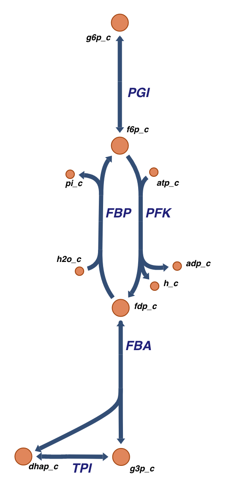
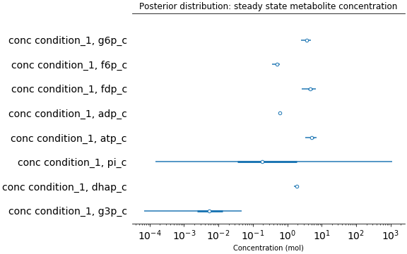
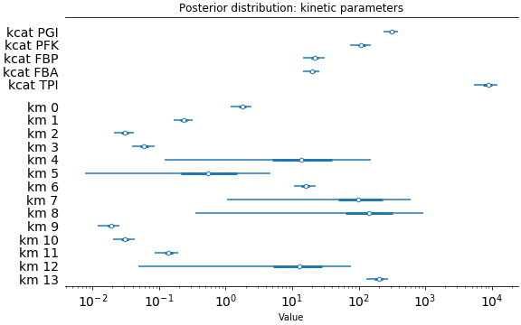

====================================
A simple model of E. coli glycolysis
====================================

This document shows how to use Maud to model the following simple but realistic
biological system:

This drawing was obtained by deleting the vast majority of reactions from the
`IJO1366 E. coli central metabolism model
<https://escher.github.io/#/app?map=iJO1366.Central%20metabolism&tool=Builder&model=iJO1366>`_
using the online modelling tool `escher <https://escher.github.io/#/>`_.

The target system has 5 reactions, including the interesting
phosphofructokinase reaction, which is thought to be highly regulated and
instrumental to the Warburg effect. The reactions are part of the glycolysis
pathway, which converts glucose into pyruvate and some ATP.

Constructing a suitable toml input
==================================

In order to model this system with Maud, we first need to decide how to
represent it, and some information about it, in Maud's input format.

Maud's input format consists of three sections: a kinetic model that describes
how the system works, a prior model describing the pre-experimental information
about the system's formation energies and kinetic parameters, and an
experiments section describing some test data and its information content.

The full toml input can be found in `Maud's GitHub repository
<https://github.com/biosustain/Maud/blob/master/tests/data/ecoli_small.toml>`_. The
following section explains how it was constructed.

Kinetic Model
-------------

The kinetic model can more or less be read off the above network diagram,
though there are some details that need to be considered.

First, we need to decide how we will define a steady state for this system. In
practical terms this means we need to specify which of the metabolites in the
network we want to treat as "balanced", i.e., such that at steady state their
concentration should be constant. In this case the balanced metabolites we
chose are f6p, fdp and dhap.

The metabolites h2o and h --i.e. water and hydrogen ion--are involved in the
PFK and FBP reactions, but are typically ignored in kinetic analyses. In order
to avoid problems with interpreting prior information from the literature, we
can ignore h by simply leaving it out of our representation of the PFK
reaction. However, we cannot fully ignore the role of h2o in the FBP reaction
because h2o has non-zero formation energy: leaving it out would re. We can
inform Maud that it needs to make the necessary thermodynamic adjustment by
adding a non-empty `water_stoichiometry` field to the FBP reaciton.

Finally, for the sake of simplicity this case study ignores all regulation,
even though this is not realistic as the PFK reaction is highly regulated.

The kinetic model section of the Maud input therefore looks as follows:

.. code-block:: toml

    metabolites = [
      {id="g6p", name="D-Glucose 6-phosphate", compartment="c", balanced=false},
      {id="f6p", name="D-Fructose 6-phosphate", compartment="c", balanced=true},
      {id="fdp", name="D-Fructose 1,6-bisphosphate", compartment="c", balanced=true},
      {id="adp", name="ADP C10H12N5O10P2", compartment="c", balanced=false},
      {id="atp", name="ATP C10H12N5O13P3", compartment="c", balanced=false},
      {id="pi", name="Phosphate", compartment="c", balanced=false},
      {id="dhap", name="Dihydroxyacetone phosphate", compartment="c", balanced=true},
      {id="g3p", name="Glyceraldehyde 3-phosphate", compartment="c", balanced=false}
    ]

    [[compartments]]
    id = "c"
    name = "cytosol"
    volume = 1

    [[reactions]]
    id = "PGI"
    name = "Glucose-6-phosphate isomerase"
    enzymes = [{id = "PGI", name = "Glucose-6-phosphate isomerase"}]
    stoichiometry = {g6p_c = -1, f6p_c = 1}

    [[reactions]]
    id = "PFK"
    name = "Phosphofructokinase"
    enzymes = [{id = "PFK", name = "Phosphofructokinase"}]
    stoichiometry = {atp_c = -1, f6p_c = -1, adp_c = 1, fdp_c = 1}

    [[reactions]]
    id = "FBP"
    name = "Fructose-bisphosphatase"
    water_stoichiometry = 1
    enzymes = [{id = "FBP", name = "Fructose-bisphosphatase"}]
    stoichiometry = {f6p_c = -1, fdp_c = 1, pi_c = -1}

    [[reactions]]
    id = "FBA"
    name = "Fructose-bisphosphate aldolase"
    enzymes = [{id = "FBA", name = "Fructose-bisphosphate aldolase"}]
    stoichiometry = {dhap_c = 1, fdp_c = -1, g3p_c = 1}

    [[reactions]]
    id = "TPI"
    name = "Triose-phosphate isomerase"
    enzymes = [{id = "TPI", name = "Triose-phosphate isomerase"}]
    stoichiometry = {dhap_c = -1, g3p_c = 1}

Priors
------

Priors for the 8 metabolites' formation energies were found using `equilibrator
<http://equilibrator.weizmann.ac.il/>`_, and are as follows:

.. code-block:: toml

  formation_energies = [
    {metabolite_id = "g6p", location = -1336.3, scale = 1.3},
    {metabolite_id = "f6p", location = -1333.8, scale = 1.3},
    {metabolite_id = "pi", location = -1073.3, scale = 1.5},
    {metabolite_id = "adp", location = -1440.8, scale = 2.4},
    {metabolite_id = "atp", location = -2313.0, scale = 3.0},
    {metabolite_id = "fdp", location = -2220.9, scale = 2.1},
    {metabolite_id = "g3p", location = -1106.4, scale = 1.3},
    {metabolite_id = "dhap", location = -1111.9, scale = 1.1},
  ]

This specification highlights a limitation of Maud's prior model: currently
Maud can only specify priors for formation energies as independent normal
distribution. In reality, there is information available not just about the
marginal values of each metabolite's formation energy, but also about
correlations between them. This is because formation energies are typically
estimated based on observations that depend on linear combinations of formation
energies. For example, the formation energies of atp and adp are estimated
using observations of the adenylate kinase reaction; these observations are
determined by a linear combination of the formation energies of atp, adp and
amp. These observations constrain the sum of atp and adp's formation energies
more closely than the marginal values. The result of this limitation is that
Maud's prior model assigns weight to formation energy configurations that are
very unlikely given the underlying information, something that should be fixed
in a future implementation.

Priors for reaction $k_{cat}$ and $k_m$ parameters are taken from the `sabio
<http://sabio.h-its.org/>`_ database, and are specified in the toml input as
follows:

.. code-block:: toml

  kcats = [
    {enzyme_id = "PGI", location = 126.0, scale = 0.2},
    {enzyme_id = "PFK", location = 110.0, scale = 0.2},
    {enzyme_id = "FBP", location = 24.0, scale = 0.2},
    {enzyme_id = "FBA", location = 7.0, scale = 0.2},
    {enzyme_id = "TPI", location = 9000.0, scale = 0.2},
  ]

  kms = [
    {enzyme_id = "PGI", mic_id = "g6p_c", location = 3.0, scale = 0.2},
    {enzyme_id = "PGI", mic_id = "f6p_c", location = 0.16, scale = 0.2},
    {enzyme_id = "PFK", mic_id = "f6p_c", location = 0.03, scale = 0.2},
    {enzyme_id = "PFK", mic_id = "atp_c", location = 0.06, scale = 0.2},
    {enzyme_id = "PFK", mic_id = "fdp_c", location = 15, scale = 1.5},
    {enzyme_id = "PFK", mic_id = "adp_c", location = 0.55, scale = 1.5},
    {enzyme_id = "FBP", mic_id = "fdp_c", location = 16.0, scale = 0.2},
    {enzyme_id = "FBP", mic_id = "f6p_c", location = 0.6899, scale = 1.5},
    {enzyme_id = "FBP", mic_id = "pi_c", location = 1.0, scale = 1.5},
    {enzyme_id = "FBA", mic_id = "fdp_c", location = 0.02, scale = 0.2},
    {enzyme_id = "FBA", mic_id = "g3p_c", location = 0.03, scale = 0.2},
    {enzyme_id = "FBA", mic_id = "dhap_c", location = 0.13, scale = 0.2},
    {enzyme_id = "TPI", mic_id = "dhap_c", location = 2.16, scale = 1.5},
    {enzyme_id = "TPI", mic_id = "g3p_c", location = 200.0, scale = 0.2},

Experimental data
-----------------

For this case study we pretend that one experiment was carried out, with the
following artificial but approximately realistic results:

.. code-block:: toml
                
  [[experiments]]
  id = 'condition_1'
  metabolite_measurements = [
    {target_id='g6p_c', value=2.0804108, uncertainty=0.188651},
    {target_id='f6p_c', value=0.6410029, uncertainty=0.146145},
    {target_id='adp_c', value=0.6113649, uncertainty=0.038811},
    {target_id='atp_c', value=5.4080032, uncertainty=0.186962},
    {target_id='fdp_c', value=4.5428601, uncertainty=0.237197},
    {target_id='dhap_c', value=1.895018, uncertainty=0.078636},
  ]
  reaction_measurements = [
    {target_id='PGI', value=4.087673533555556, uncertainty=0.1},
    {target_id='FBP', value=-0.5, uncertainty=0.1},  # made up
  ]
  enzyme_measurements = [
    {target_id='PGI', value=0.03338748587758992, uncertainty=0.06406406775305307},
    {target_id='FBP', value=0.005712846258143446, uncertainty=0.1513769774104986},
    {target_id='FBA', value=0.0704592675242211, uncertainty=0.2078269607533649},
  ]

Fitting the model
=================

To download the input from GitHub using `curl <https://curl.haxx.se/>`_ we can use the following command:

.. code-block:: bash

    curl -LJO https://raw.githubusercontent.com/biosustain/Maud/ecoli_small/tests/data/ecoli_small.toml

Next, we can use Maud to generate posterior draws as follows:

.. code-block:: bash

    maud sample ecoli_small.toml --n_warmup 200 --n_samples 200

Analysing the results
=====================

After a little while, Stan's sampler has finished, some csv files starting
`inference_model` have been populated and Maud has printed the following
diagnostic information:

.. code-block:: bash

    Checking sampler transitions treedepth.
    Treedepth satisfactory for all transitions.

    Checking sampler transitions for divergences.
    No divergent transitions found.

    Checking E-BFMI - sampler transitions HMC potential energy.
    E-BFMI satisfactory for all transitions.

    Effective sample size satisfactory.

    Split R-hat values satisfactory all parameters.

The diagnostic message raises no warnings, indicating that Maud's output files
probably represent draws from the posterior distribution defined by our input.

Investigating the marginal posterior distributions for metabolite
concentrations, the results appear broadly plausible.

Similarly, the marginal posteriors for reaction fluxes are close to the
measured value of -0.5 for FBP and 4.08 for other reactions:

Finally, the marginal posteriors for kinetic parameters are also plausible,
though the :math:`k_{cat}` parameter for the TPI reaction is very high at
around 10000.

