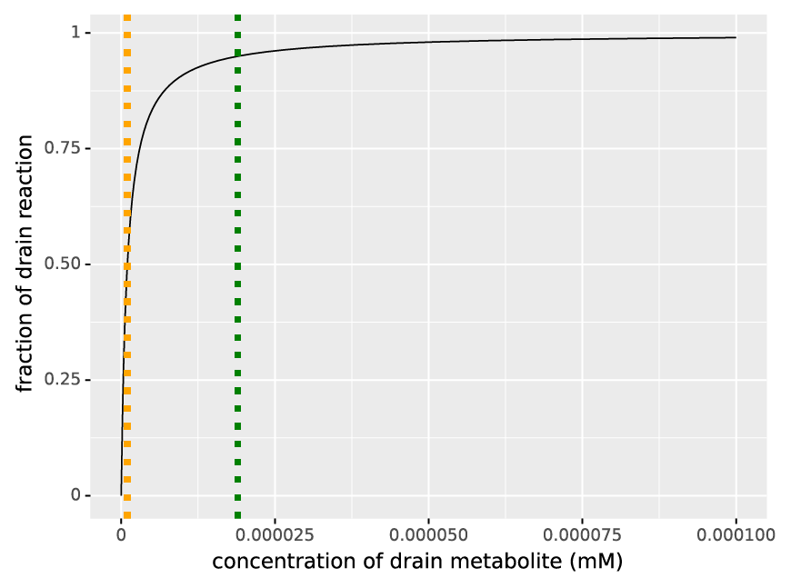

===============
Drain Reactions
===============

This document explains the assumptions about drains in Maud.

Drains
======

Drains are required to specify a fixed amount of flux to or from a metabolite.
An issue occurs when the drain flux is higher than the :math:`V_{max}` of the pathway,
draining the metabolite until the ode reaches a negative concentration. This is a
problem for all zeroth order reaction kinetics. We address this problem by making
the flux zeroth order with respect to the concentration of the drained metabolite at
expected concentrations, and first order as :math:`[X_i] \rightarrow 0`.

A simple implementation is a pseudo-Michaelis-Menten type function, where the Michaelis-
Menten constant is a very small concentration unexpected in the cell. 

Implementation
==============

The current formula to calculate drains is defined as:

.. math::
	v = v_{drain constant} \prod_i \frac{[X_i]}{[X_i] + 10^{-6}}

where:

- :math:`v` is the rate of the drain,
- :math:`v_{drain constant}` is the expected drain rate,
- :math:`[X_i]` is the concentration of metabolite :math:`i`

Using the current specification the output for a single metabolite
drain is shown in :numref:`(Fig. %s) <fraction_of_drain>`.

.. _fraction_of_drain: 

    fraction of expected drain rate as a function of a metabolite concentration.
    The red dotted line is the pseudo-Michaelis-Menten constant at a concentration
    of :math:`10^{-6} mM`, and, the orange dotted line defines the concentration 
    required for 95% of the rate, which is :math:`1.9 \times 10^{-5} mM`.

