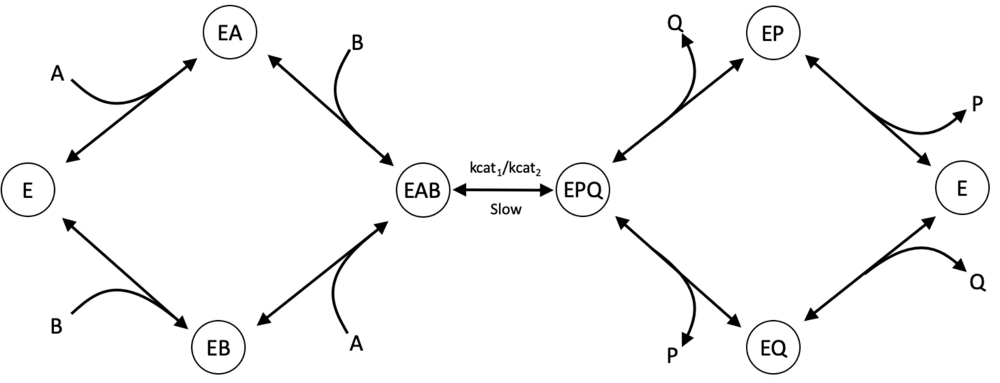
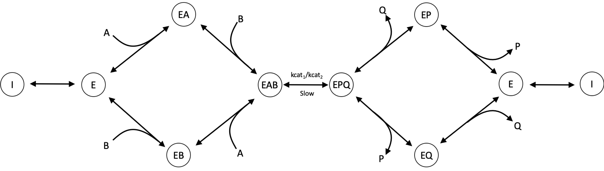

===============
Enzyme kinetics
===============

This document explains the assumptions about enzyme kinetics that Maud uses.

Modular rate law
================

This section outlines the assumptions made with the modular rate law, and includes a derivation of a 2 substrate (A, B),
2 product (P, Q) random mechanism with competitive inhibitor I. It also highlights the general structure of the
modular rate law used in Maud. The modular rate law framework was taken from [1],
and was adapted to suit our structure. The general rate structure for the modular rate
law is given below

.. math::
    v =  E_t f \frac{T}{D + D^{reg}}

where,

.. math::
    T = kcat_{1}\prod_{i, substrate}
    (\frac{X_i}{K_{m, i}})^{|n_i|} 
    - kcat_{2}\prod_{i, product}(\frac{X_i}{K_{m, i}})^{|n_i|} \\

    D = \prod_{i, substrate}(1 + \frac{X_i}{K_{m, i}})^{|n_i|} 
    + \prod_{i, product}(1 + \frac{X_i}{K_{m, i}})^{|n_i|}.

Additionally, :math:`E_t` is the total enzyme concentration, :math:`f` is a regulatory function, and , :math:`D^{reg}` 
considers specific binding regulation [1]. :math:`n_i` is the stoichiometric value for each metabolite
in the reaction, however, in [1] it is considered as a structure number accounting for
cooperativity. In the Maud framework, cooperativity (allostery) is integrated using the generalised
MWC model seperating the regulatory modulators from the catalytic rate.

Assumptions
-----------

The assumptions used in the modular rate law are listed below:
    - the metabolite binding occurs in a random order,
    - binding does not occur simultanesouly,
    - substrates and products cannot bind at the same time,
    - metabolite binding rates are much higher than the interconversion of substrate to product (rapid equilibrium assumption),
    - metabolite binding affinity is independent of order.

Example: 2 products and 2 substrate network
-------------------------------------------

    A random mechanism with 2 products and 2 substrates with a slow conversion step. All of the reactant
    binding/release steps are in rapid equilibrium. All enzyme states :math:`E_X` and metabolites
    will be in terms of concentrations, however the square brackets will be removed for
    readability.

For a random Bi-Bi network with the above assumptions, the rate will be the following

.. math::
   v = E_t \frac{kcat_1 a' b' - kcat_2 p' q'}{(1 + a')(1 + b') + (1 + p')(1 + q') -1}.

where, for metabolite X the corresponding term is given by

.. math::
   x' &= \frac{X}{K_m^{x}} \\
   K_m^{x} &= \frac{X \bullet E_{X, unbound}}{[E_{X, bound}]}.

Because we assume binding to be independent of order of addition, there can be
multiple relationships for a given :math:`K_m^{x}`. For example,  
:math:`K_m^{A} = \frac{A \bullet E}{EA} = \frac{A \bullet EB}{EAB}`

The rate is determined by the conversion from substrate to product and using
elementary mass action kinetics is

.. math::
   v = kcat_1 EAB - kcat_2 EPQ.

Because of the rapid equilibrium assumption, the Michaelis-Menten constants are approximated 
by the dissociation constants. All enzyme state concentrations can be determined from the free
enzyme concentration and metabolite concentrations. In this case

.. math::
   EA &= a' E_0  \\
   EB &= b' E_0  \\
   EAB &= a' EB = b' EA = a' b' E_0 \\\\
   EP &= p' E_0  \\
   EQ &= q' E_0  \\
   EPQ &= p' EQ = q' EP = p' q' E_0.

With the free enzyme concentration being a function of free enzyme ratio :math:`\theta` and
total enzyme concentration

.. math::
   E_0 &= E_t - \sum_{i, bound} E_i \\
    &= E_t - E_0 (a' + b' + a' b' + p' + q' + p' q') \\
    &= E_t \theta

where

.. math::
    \theta = \frac{1}{1 + a' + b' + a' b' + p' + q' + p' q'}.
   
After substituting the enzyme concentrations into the rate equation it becomes

.. math::
   v = E_t \theta (kcat_1 a' b' - kcat_2 p' q').

Competitive inhibition
----------------------
In the following case we will consider competitive inhibition where an inhibitor
selectively binds to the free enzyme, preventing binding from either substrate or
product.

    A random mechanism with 2 products and 2 substrates with a slow conversion step.
    all metabolites including the inhibitor are in rapid equilibrium with the enzyme
    states.

As described in [1], competitive inhibition is accounted for in the denominator
term of the rate equation. It's easy to see how this occurs when you look at the free
enzyme concentration

.. math::
   EI = i' E_0.

by using the previous 

.. math::
    E_0 &= E_t - \sum_{i,bound} E_i \\

and

.. math::
    \theta = \frac{1}{1 + a' + b' + a' b' + p' + q' + p' q' + i'}.

which can then be substituted into the original rate equation with the form

.. math::
   v = E_t \frac{kcat_1 a' b' - kcat_2 p' q'}{(1 + a')(1 + b') + (1 + p')(1 + q') + i' -1}.

Allostery
---------

Differing from the modular rate law defined in [1],
allostery is considered using the generalised MWC form [see allostery link]. This 
requires the free enzyme amount - calculated above.

References
==========
[1] Liebermeister, W., Uhlendorf, J. & Klipp, E. Modular rate laws for enzymatic reactions: 
thermodynamics, elasticities and implementation. Bioinformatics 26, 1528–1534 (2010).