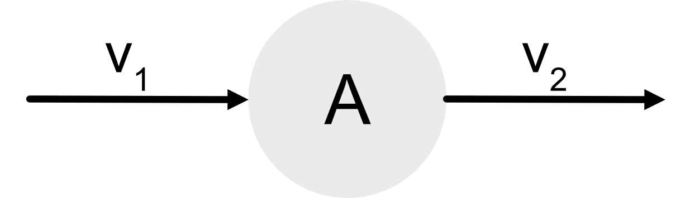
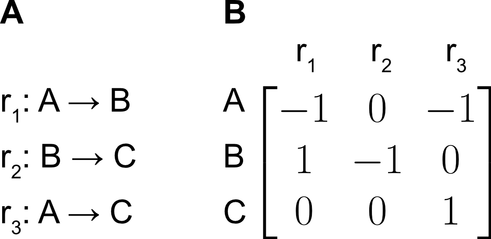

===============
Kinetic Models
===============

Introduction to Kinetic Models
==============================

A kinetic model can be description of metabolism, which is constrained by the rate laws of the involved reactions. As an example, 
let’s observe a hypothetical metabolite :math:`A` with the metabolite flows defined in the figure below. The rate of change of 
:math:`A` is given by the following equation with arbitrary form:

.. math::
    \frac{dA}{dt} = v_1(A,\theta_1) - v_2(A, \theta_2)

If we know the functions for :math:`v_1` and :math:`v_2` we can determine the concentration of :math:`A` over time, given an initial state :math:`A_0` 
and :math:`theta_i`.

.. math::
    A_t = \int_0^t v_1(A,\theta_1) - v_2(A, \theta_2) dt

A metabolic network is formed by connecting metabolites through reactions, thus creating a tightly coupled network. 
For example, if :math:`v_2` leads to a metabolite :math:`B`, the concentration of :math:`B` is dependent on :math:`A`. The resulting system of ODEs 
must be solved simultaneously.

The network can be represented with a stoichiometrix matrix (S) in which each row represents a metabolite, each 
column a reaction and each entry represents the corresponding stoichiometric coefficient for the metabolite in the 
reaction. The following figure is a three reaction network which is represented in a stoichiometric matrix

Using the stoichiometric matrix, we can express the system of ODEs in concise matrix form:

.. math::
    \frac{dC_i}{dt} &= \Sigma_j S_{ij} v_j \\
    \frac{dC}{dt} &= Sv

where :math:`S_{ij}` is the stoichiometric coefficient of metabolite :math:`i` in reaction :math:`j` and :math:`v_j` is the flux for reaction :math:`j`.

Steady State Assumption
=======================

Maud evaluates the metabolism to a psuedo-steady-state such that:

.. math::
    \frac{dC_i}{dt} &= 0 \\
    \text{or,} \\
    Sv &= 0

The following assumptions are made about the system:

1. Enzyme concentrations are constant over time, and,
2. The flows In and Out of a metabolite due to reactions are much higher than the dilution rate due to growth.

Assumption 2. can be relaxed by accounting for the growth rate, however, we leave this to the user to implement.

Flux vector representation
==========================

In a kinetic model, each flux is expressed as a rate law:

.. math::
    v_j = f(E,C,k, \Delta G^0)

where: 

* :math:`j` is the reaction :math:`j`;
* :math:`E` is the enzyme concentration;
* :math:`C` are the metabolite concentrations;
* :math:`k` are the kinetic parameters;
* :math:`\Delta G^0` is the standard Gibbs energy of reaction

The rate laws can incorporate allosteric effectors, competitive inhibition, reaction mechanisms, 
and varied protein concentrations. Common rate laws include: mass action kinetics where the rate 
is a scaled-product of the reactant concentrations, or Michaelis-Menten kinetics which reproduce enzyme 
saturation behavior.

The current default mechanism is the :doc:`Modular Rate Law <../theory/enzyme_kinetics>`, which is augmented
using the Generalised Monod-Wyman-Changeux formalism for allostery. Additional rate laws can be easily implemented 
by the user.

Out of Scope
============

Dynamic model fitting
---------------------

Whilst theoretically possible and useful for circumstances such as substrate pulses, fitting concentrations
at multiple timepoints would require a significant restructuring of the current implementation. Therefore,
we limit measurement evalutions to steady state evaluations.

Limit Cycles
------------

Parameterisations which result in limit cycles are currently unsupported. A limit cycle is a stable 
oscillatory solution that doesn't achieve a steady state, it has been observed in Yeast glycolysis
and can be approximated by taking the average of the ossciations as the measurement of the system, 
as seen in `How Yeast Cells Synchronize their Glycolytic Oscillations: A Perturbation Analytic Treatment 
<https://www.sciencedirect.com/science/article/pii/S0006349500766677>`_. However, the current method
does not permit for averaging and will indicate that the solution is unstable, regardless of simulation time.

Solving System of ODEs
======================

To determine the steady-state solution Maud we evaluate the system of ODEs as an initial value problem,
integrating the system over an arbitrary period of time that is defined by the user. Tolerances for steady
state evaluation can be altered in the source code under - src/maud/inference_model.stan. This acts as an 
indicator which will prompt the user if the timepoint selected is insufficient, or may be a result of Limit Cycles.
The principle assumption of this method is that there is a unique solution for every initial point, assuming
every :math:`x_0 \gt 0`. By initialising the concentrations as close to the measured values as possible: simulation 
time is minimised; and of the possible non-unique solutions, the solution that is closest to the initial value and
hence measurement will ideally be selected. There is no current implementation in Maud to determine multiple solutions.